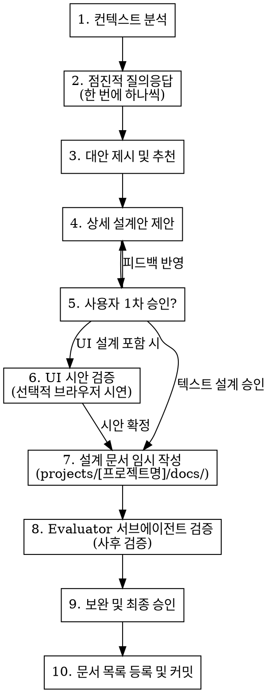

# zb-brainstorming

이 스킬은 사용자 피드백을 통해 아이디어를 점진적으로 구체화하고, 작성된 아키텍처 설계 문서(예: `projects/[프로젝트명]/docs/design-docs/[명칭]-design.md`)에 대해 독립된 **판별자(Evaluator) 서브에이전트**의 회의적 검증을 거쳐 최종 설계를 확정하는 협업 워크플로우를 정의합니다.

## 🛠️ 핵심 체크리스트 (Checklist)

1. `[ ]` **프로젝트 컨텍스트 탐색**: 최신 파일 구조, 기존 설계 문서, 가이드라인 분석
2. `[ ]` **점진적 질의응답을 통한 요구사항 구체화**: 한 번에 하나씩 명확한 질문을 던져 요구사항(목적, 제약조건, 성공 기준)을 명확화합니다.
3. `[ ]` **설계 대안 제안**: 2~3가지 설계 대안과 각 장단점 분석을 제안하고 추천 설계 방향을 제시합니다.
3.5. `[ ]` **디자인 시스템 컴포넌트 사전 확인** (UI 포함 설계 시): `mono-repo/design-system/components/index.ts` 탐색 → 재사용 가능 컴포넌트(Button, Card, Chip, TextField, Badge, Skeleton, ScrollArea 등) 확인 → 설계 문서 tech stack에 UI 요소별 DS 컴포넌트 명시. 구현 에이전트가 UI를 처음부터 작성하지 않도록 **토큰 절감**.
4. `[ ]` **단계별 상세 설계 제안 및 1차 승인**: 상세 설계(아키텍처, 컴포넌트 구조, 데이터 흐름 등)를 구획별로 나누어 제안하고 사용자 피드백을 반영해 승인을 얻습니다.
5. `[ ]` **Visual Companion 사용 여부 확인**: 설계가 UI·레이아웃·컴포넌트 등 시각적 요소를 포함한다면 사용자에게 명시적으로 질문 — *"브라우저에서 시각적 시안을 보여드릴 수 있습니다. 시안 검토를 원하시나요?"* — 원하는 경우 시각적 시연 절차에 따라 서버를 기동하고 피드백 수집 후 설계에 반영
6. `[ ]` **설계 문서 작성**: 작업 대상 프로젝트의 폴더 하위 경로(예: `projects/[프로젝트명]/docs/design-docs/[주제]-design.md`)에 문서를 작성하고, 해당 프로젝트 내의 설계 문서 인덱스 파일(예: `projects/[프로젝트명]/docs/design-docs/index.md`)이 있으면 링크를 등록합니다. **(주의: 모노레포 루트가 아닌, 반드시 작업 중인 특정 프로젝트 폴더 하위에 생성해야 합니다.)**
7. `[ ]` **Evaluator (판별자 - 회의적 검증) 사후 호출**: 작성된 설계 문서 경로를 넘겨 회의적 검증 서브에이전트(`evaluator-prompt.md`)를 실행합니다. 설계의 취약점/예외 상황/YAGNI 위반사항만 무자비하게 색출합니다.
8. `[ ]` **피드백 반영 및 최종 승인**: Evaluator가 제기한 리스크 중 조치가 필요한 부분을 반영하여 문서를 보완하고 사용자 최종 승인 획득 후 커밋합니다.

---

## 🔄 프로세스 흐름 (Process Flow)



---

## 📝 설계 문서 템플릿 (Design Doc Template)

대상 프로젝트 폴더 하위의 설계 문서 디렉토리(예: `projects/[프로젝트명]/docs/design-docs/[주제]-design.md`)에 작성하며 다음 양식을 따릅니다:

```markdown
# [설계 주제] Design Document

## 1. 목적 & 요구사항 (Goal & Requirements)
- 해결하려는 문제와 주요 요구사항

## 2. 검증 및 피드백 (Evaluation & Feedback)
- **판별자(Evaluator)가 제기한 주요 이슈**: 
- **조정(Refining) 및 반영 대책**: 

## 3. 상세 설계 (Detailed Design)
- 아키텍처, 컴포넌트 구조 및 데이터 흐름

## 4. 예외 및 실패 대응 (Edge Cases & Fault Tolerance)
- 잠재적 실패 시나리오 및 예외 처리 정책
```

---

## 🎨 디자인 시스템 연동 전략 (토큰 효율화)

UI를 포함한 설계에서는 `mono-repo/design-system/`의 Montage DS를 우선 활용합니다.  
설계 단계에서 DS 컴포넌트를 명시하면, 구현 에이전트가 UI 스타일을 처음부터 결정하지 않아도 되어 **실행 플랜 토큰을 대폭 절감**합니다.

### 확인 순서

1. `design-system/components/index.ts` 탐색 — 재사용 가능 컴포넌트 목록 확인
2. `design-system/tailwind.config.ts` 탐색 — 시맨틱 토큰 이름 파악 (`bg-background-elevated-normal`, `text-label-normal`, `text-primary-normal` 등)
3. 설계 문서 tech stack 섹션에 UI 요소별 DS 컴포넌트 매핑 표 작성

### 설계 문서 기재 방식 (tech stack 섹션 예시)

| UI 요소 | DS 컴포넌트 | 주요 시맨틱 토큰 |
|---|---|---|
| 주 버튼 | `<Button variant="solid" color="primary">` | `bg-primary-normal text-static-white` |
| 텍스트 입력 | `<TextField>` | — |
| 탭 / 칩 | `<Chip>` (활성: `color="primary"`) | `text-label-normal` |
| 카드 | `<Card>` | `bg-background-elevated-normal` |
| 로딩 | `<Skeleton>` | — |
| 스크롤 영역 | `<ScrollArea>` | — |
| 테마 | `<ThemeProvider>` from `@ds` | — |

### 금지 사항

- 하드코딩 색상 클래스(`zinc-*`, `blue-*`, `gray-*`) — 시맨틱 토큰으로 대체
- `next-themes` 직접 사용 — DS `ThemeProvider` 사용
- DS에 동일 컴포넌트가 있는데 새로 구현 — 항상 DS 우선 확인 후 설계

### 초기 셋업 (Task 1에 포함)

- `tailwind.config.ts` → `design-system/tailwind.config.ts`의 `theme.extend` 내용 포함
- `src/app/globals.css` → `design-system/globals.css` CSS 변수 복사 (`:root`, `.dark` 블록)
- `tsconfig.json` → `"@ds": ["../../design-system/components"]` path alias 추가

---

## ⚠️ 흔한 실수 (Common Mistakes)

- **코드 작성 먼저 수행**: 설계 완료 및 사용자 최종 승인 전에 실제 구현(Implementation)에 돌입하는 행위
- **사후 검증 생략**: 설계 문서 작성 후 Evaluator 서브에이전트를 통한 비판적 검토 단계를 건너뛰는 행위
- **과도한 한 번에 질문**: 여러 개의 열린 질문을 동시에 던져 흐름을 혼란스럽게 만드는 행위 (반드시 한 번에 한 질문만 던질 것)
