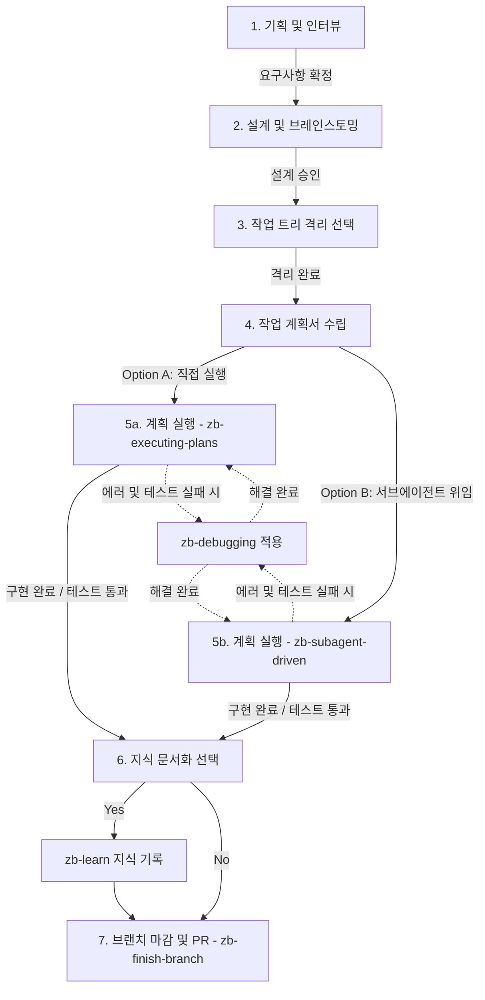

# Mono-Repo — Agent Map

## Repository Layout

```
mono-repo/
├── package.json            # npm workspace root (workspaces: design-system, projects/nsq)
├── node_modules/           # 모든 의존성 호이스팅 위치 (npm이 관리)
├── design-system/          # Shared design system (@repo/design-system workspace package)
│   ├── package.json        # workspace 패키지 선언 (peerDependencies만 명시)
│   ├── components/         # Reusable UI components
│   ├── globals.css         # Global CSS variables & base styles
│   ├── tailwind.config.ts  # Shared Tailwind configuration
│   └── DESIGN.md           # Design tokens, typography, color system docs
└── projects/               # Individual product workspaces
    └── nsq/                # Project: NSQ Shadowing
```

## Design System

- **Single source of truth** for tokens, components, and Tailwind config.
- All projects **must** import from `design-system/` — no per-project style duplication.
- Before modifying any component or token, read `design-system/DESIGN.md` (or its split docs under `design-system/docs/`).
- Stack: TailwindCSS · Pretendard font · coolicons SVG · Light/Dark via `next-themes`.
- Tailwind numeric spacing utilities must preserve Tailwind base semantics. Design-system pixel spacing tokens are exposed only through `ds-*` keys such as `p-ds-8`; never redefine numeric spacing keys like `8` or `10`.
- When changing Tailwind config or shared primitives such as `Button`, verify rendered dimensions in a browser, not only with unit tests.

### Frontend Design Priority

UI/UX 구현, 리팩토링, 리뷰 시 다음 우선순위를 적용한다.

1. `design-system/` — 프로젝트의 최상위 기준. 토큰, 컴포넌트, Tailwind 설정을 우선 사용한다.
2. `frontend-design` — `design-system/`에 없는 레이아웃/상호작용 판단을 보완한다.
3. `web-design-guidelines` — 최종 UI 품질, 접근성, 사용성 리뷰 체크리스트로 사용한다.

충돌 시 항상 더 높은 우선순위의 기준을 따른다.

## npm Workspaces

이 모노레포는 npm workspaces로 관리됩니다.

- **루트 `package.json`** — `workspaces` 배열에 모든 패키지 경로 선언
- **의존성 호이스팅** — `npm install`을 루트에서 실행하면 모든 워크스페이스 의존성이 루트 `node_modules/`에 통합
- **design-system** — `@repo/design-system` 패키지명으로 등록. 각 프로젝트는 이를 dependency로 추가
- **수동 심볼릭 링크 불필요** — npm이 자동 처리

## Git Hooks & Commit Quality

루트에 husky + lint-staged + commitlint이 설정되어 있습니다.

- **`pre-commit`**: `lint-staged` 실행 — staged `.ts/.tsx` 파일에 `eslint --fix`
- **`commit-msg`**: `commitlint` 실행 — Conventional Commits 형식 강제

**커밋 메시지 형식**: `<type>(<scope>): <subject>` (예: `feat(nsq): 기능 추가`)

lint-staged는 루트 `package.json`의 `workspaces` 배열과 각 프로젝트의 `eslint.config.*` 파일 존재 여부를 동적으로 감지합니다. 새 프로젝트에 eslint config 파일이 있으면 `lint-staged.config.mjs` 수정 없이 자동 적용됩니다.

## Adding a New Project

1. Create `projects/<project-name>/`.
2. Add `package.json` with `"@repo/design-system": "*"` in dependencies.
3. Add the project path to the root `package.json` `workspaces` array.
4. **`eslint.config.mjs`(또는 `.js`, `.cjs`)를 프로젝트 루트에 추가** — lint-staged 자동 감지 조건.
5. Run `npm install` from the mono-repo root.
6. Add a `projects/<project-name>/AGENTS.md` following the pattern in `projects/nsq/AGENTS.md`.

## Per-Project Agent Docs

| Project | Agent Map                                                |
| ------- | -------------------------------------------------------- |
| nsq     | [projects/nsq/AGENTS.md](projects/nsq/AGENTS.md) |

## 🔄 모노레포 공통 개발 워크플로우 (zb- 스킬셋)

모든 에이전트는 기능 개발, 리팩토링, 버그 수정 시 다음 표준 프로세스를 엄격히 준수해야 합니다.



### 단계별 스킬 및 역할 매핑

1. **기획/인터뷰 (`zb-goal-interview`)**: 목표 95% 확신 획득 및 `GOAL.md` 작성.
2. **설계 (`zb-brainstorming`)**: 시각화(`zb-visualize`) 동반 설계 시안 작성 및 승인.
3. **격리 환경 (`zb-worktrees`)**: 작업용 git worktree 격리 작업 공간 선택적 생성.
4. **계획 수립 (`zb-writing-plans`)**: `*-plan.md` 및 `*-checklist.json` 작성, `exec-plans/index.md` 활성화 등록. 선택된 디자인 산출물이 요청에 포함되면 실행 전에 반드시 사용하고, UI/제품 계획은 `Source Artifact Ledger`, `Scope Lock`, `Visual Contract`, browser visual evidence로 브레인스토밍/목업 산출물을 보존한다.
5. **실행 & 구현 (`zb-executing-plans` / `zb-subagent-driven-development`)**: `zb-TDD` 규칙에 맞춰 구현 및 리뷰어 검증. (UI/스타일 변경 작업 시 [design-system](.claude/skills/design-system/SKILL.md) 스킬 원칙을 강제하며, 실패 시 `zb-debugging` 발동)
6. **지식 문서화 (`zb-learn`)**: 에러 해결 지식을 `docs/solutions/`에 기록.
7. **마감 (`zb-finish-branch`)**: `AGENTS.md` 최신화 검토 및 로컬 머지/PR 생성.

---
