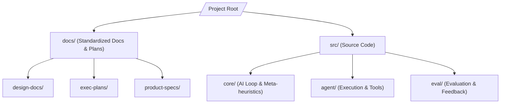

# Architecture Map (SIA - Self Improving A.I.)

This document provides a high-level package and domain mapping of the repository to orient agents and human developers working on the Self Improving A.I. project.

## 📂 Core Component Map

* **`/docs/`**: Primary documentation hub.
  * **`design-docs/`**: High-level designs and core decisions (e.g., meta-prompting, improvement loops).
  * **`exec-plans/`**: Active and completed execution plans, and the technical debt tracker.
  * **`product-specs/`**: Product requirements, specifications, and objectives.
* **`/src/`**: Primary source code directory (to be implemented).
  * **`core/`**: Orchestration of the self-improvement loop, prompting engine, and evolutionary strategy.
  * **`agent/`**: Execution environment, actions, tools, and integration wrapper.
  * **`eval/`**: The critique/evaluator component that analyzes code performance and decides whether to commit improvements.
