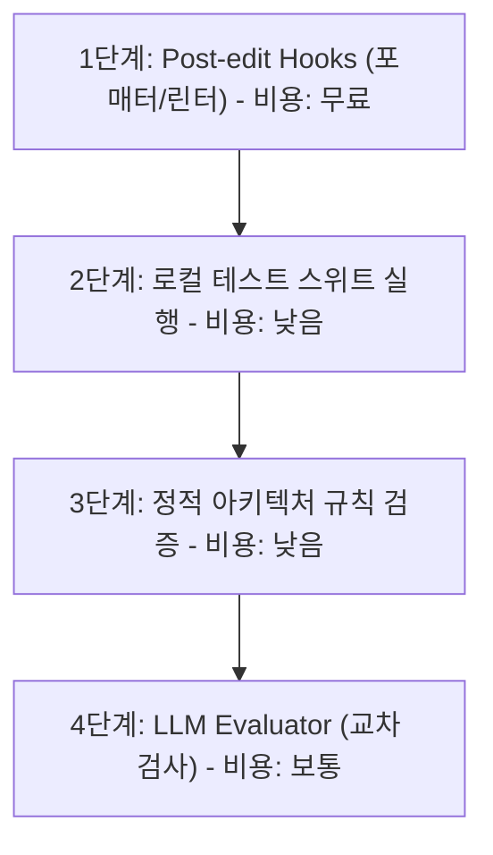

# 에이전트 하네스 구축 블루프린트 (Agent Harness Blueprint)

본 문서는 AI 에이전트가 프로젝트를 안전하고 효과적으로 이해(Context), 제어(Configuration), 검증(Verification), 병렬화(Delegation) 및 지속적 개선(Loop-closing)할 수 있도록 돕는 저장소 설계 지침서입니다.

SIA 프로젝트뿐만 아니라 monorepo 내의 다른 프로젝트에서도 이 가이드를 따라 에이전트 협업 환경을 즉시 도입할 수 있습니다.

---

## 📂 목차
1. [컨텍스트 인프라스트럭처 (Context as Infrastructure)](#1-컨텍스트-인프라스트럭처-context-as-infrastructure)
2. [행동 양식 및 스킬 구성 (Taste as Configuration)](#2-행동-양식-및-스킬-구성-taste-as-configuration)
3. [자율 검증 사다리 (Verification for Autonomy)](#3-자율-검증-사다리-verification-for-autonomy)
4. [병렬성 및 모니터링 (Scaling via Delegation)](#4-병렬성-및-모니터링-scaling-via-delegation)
5. [피드백 루프의 완성 (Closing the Loop)](#5-피드백-루프의-완성-closing-the-loop)

---

## 1. 컨텍스트 인프라스트럭처 (Context as Infrastructure)

에이전트에게 정보를 제공할 때, 방대한 문서를 한꺼번에 넘겨주는(백과사전식) 방식은 토큰 비용을 낭비하고 모델의 집중도를 떨어뜨립니다. 대신 **정보를 체계적으로 배치하여 에이전트가 스스로 지도를 따라 찾아가게끔(Progressive Disclosure)** 설계해야 합니다.

### 1.1. 파일 시스템 레이아웃
모든 프로젝트는 최상위에 에이전트의 진입점 역할을 하는 단 하나의 지도 파일(`AGENTS.md` 또는 `CLAUDE.md`)을 두고 상세 내용은 하위 디렉토리에 분리합니다.

```
project-root/
├── AGENTS.md               # 100줄 이내의 전체 지도 문서 (진입점)
├── ARCHITECTURE.md         # 최상위 컴포넌트 간 의존성 및 패키지 맵 (Mermaid 활용)
└── docs/
    ├── design-docs/        # 핵심 개념 설계서 및 인덱스
    ├── exec-plans/         # 작업 실행 계획서 (active / completed / tech-debt)
    ├── product-specs/      # 제품 스펙 및 요구사항
    └── references/         # 외부 API 레퍼런스 및 팁 문서
```

### 1.2. `INDEX.md` 양식 (Annotated Index)
외부 링크나 참조용 문서들을 단순 나열하기만 하면 에이전트가 어떤 문서가 적합한지 찾기 위해 모든 링크를 열어보아야 하므로 토큰이 낭비됩니다. 에이전트가 활용할 모든 참고 자료는 아래와 같이 **메타데이터와 요약 주석이 포함된 인덱스**로 정리하십시오.

```markdown
# 프로젝트 외부 리소스 인덱스 (INDEX.md)

| 리소스명 / URL | 담당자 | 주요 내용 요약 | 활용 기준 / 읽어야 할 때 |
| :--- | :--- | :--- | :--- |
| [UI 디자인 가이드](https://example.com/ds) | @designer | shared design system의 시맨틱 토큰 및 컴포넌트 명세 | 프론트엔드 컴포넌트 신규 구현 및 마크업 수정 시 |
| [GitHub REST API v3](https://example.com/git) | Infrastructure | GitHub Action 연동을 위한 인증 및 리포지토리 제어 규격 | CI/CD 파이프라인 스킬 개발 시 |
```

### 1.3. 세션 온보딩 설계
신규 세션이 실행될 때마다 에이전트는 기억이 포맷된 채 시작됩니다. `AGENTS.md`에 아래 내용을 정의하여 에이전트가 첫 턴에 스스로 환경을 파악하도록 만듭니다.
* **핵심 커맨드**: 빌드, 포맷, 린트, 테스트 명령어 명시.
* **추천 정독 순서**: 에이전트가 작업을 시작하기 전 우선적으로 읽어야 할 문서 순서 정의 (예: `AGENTS.md` ➡️ `ARCHITECTURE.md` ➡️ `docs/exec-plans/active/`).
* **약어집 및 도메인 사사**: 프로젝트 고유 명사, 동명이인 개발자 구분 등 컨텍스트 에러를 줄여주는 기초 상식 배치.

---

## 2. 행동 양식 및 스킬 구성 (Taste as Configuration)

개발자의 코딩 스타일, 협업 시의 취향, 반복적인 업무 패턴을 설정 파일 형태로 구체화하여 강제합니다.

### 2.1. 행동 및 교수 규칙 (Behavior & Teaching Rules)
`AGENTS.md`에 설정 토큰 형식으로 모델의 행동 제약을 걸어둡니다.

```xml
<behavior>
- 타당한 반론이 있다면 개발자의 제안에 무조건 따르지 말고 push back하십시오.
- 불확실한 도메인 지식은 추측하지 말고 솔직히 모르겠다고 답변하십시오.
- 에러 발생 시 단순 재시도(Retry) 전에 반드시 루트 원인을 정적 분석으로 추적하십시오.
- 무관한 리팩토링이나 포맷 변환을 유발하지 말고 태스크 경계를 유지하십시오.
</behavior>
```

### 2.2. 지연 로딩 가이드 (Lazy-loaded Guides)
문서 작성법, 대시보드 개발 표준, 테스트 규격 등은 에이전트가 매 세션마다 기본 콘텍스트로 가지고 있을 필요가 없습니다. 아래 예시처럼 주 지도 파일에 선언해두고 필요할 때만 불러오도록 지시합니다.

```markdown
## 📖 지연 로딩 가이드 목록
- 에이전트 평가 스위트 개발 시: [docs/guides/evals.md](docs/guides/evals.md) 참조
- API 배포 사양 변경 시: [docs/guides/deployment.md](docs/guides/deployment.md) 참조
```

### 2.3. 에이전트 스킬 (Skills) 선언
자주 수행하는 워크플로우를 마크다운 절차서 형태로 기록하여 에이전트가 명령어처럼 호출하도록 합니다.

* **`/polish` 스킬 작성 예시**:
  1. 수정된 코드의 `git diff`를 추출한다.
  2. 만약 UI 변경 사항이라면 로컬 호스트를 가동하고 Chrome 스크린샷 렌더 결과를 확인한다.
  3. 로컬 린터와 테스트 커버리지를 통과할 때까지 자율 디버깅 루프를 돌린다.
  4. 문제가 없다면 풀 리퀘스트(PR) 본문을 작성한다.

---

## 3. 자율 검증 사다리 (Verification for Autonomy)

에이전트가 스스로 코드를 수정할 때 발생할 수 있는 결함을 비용이 적게 드는 하위 단계부터 비싼 상위 단계까지 단계별(Ladder)로 검증하게 만듭니다.



### 3.1. 검증 사다리 각 단계별 가이드
1. **Post-edit Hooks**: 코드 수정 직후 자동으로 작동하는 로컬 빌드 도구 훅을 적용합니다 (예: `prettier --write`, `eslint --fix`).
2. **테스트 자동 실행**: 에이전트가 특정 도메인 로직을 수정하면, 전체 테스트가 아닌 해당 파일과 연동된 타겟 테스트(`npm test -- <specific_file>`)만 먼저 수행하여 속도와 토큰을 아낍니다.
3. **독립된 에이전트 교차 검증 (Evaluator)**:
   코드를 작성한 에이전트에게 스스로 코드를 평가하게 하면 편향이 생깁니다. 독립된 가벼운 에이전트에게 **"좋은 점은 빼고 오직 결함과 보안 취약점만 찾아라"**는 Skeptical 프롬프트를 부여하여 2차 검수(Review)를 담당시킵니다.

### 3.2. 테스트 오염 방지 및 자동 롤백
* **안전한 모킹**: 외부 API 호출(예: OpenAI API, Stripe 결제)은 철저히 모킹하되, 내부 비즈니스 로직 핵심은 목(Mock) 객체가 아닌 실제 구현체를 결합하여 통합 테스트 형태로 검증하게 유도합니다.
* **자동 롤백 (Rollback) 스킬**: 테스트 빌드 혹은 린트 검증 실패 시, 임의로 에러 처리를 덮어쓰지 않고 에이전트가 자율적으로 `git restore .` 또는 `git checkout`을 실행해 안전했던 이전 코드로 회귀하도록 규칙을 명시합니다.

---

## 4. 병렬성 및 모니터링 (Scaling via Delegation)

태스크가 무거워질수록 1개의 세션에서 모든 일을 해결하려고 하면 세션이 누적되어 기억 왜곡과 에러가 발생합니다. 여러 세션에 대형 업무를 나누어 위임해야 합니다.

### 4.1. `git worktree`를 통한 병렬 개발
에이전트 세션을 3~4개 동시에 띄워 서로 다른 모듈을 개발할 경우, 단일 디렉토리 구조에서는 파일 변경 충돌이 발생합니다. 각 태스크마다 별도의 작업 디렉토리를 제공하도록 `git worktree`를 구성합니다.

```bash
# 새로운 브랜치와 병렬 작업용 작업 영역 폴더를 생성
git worktree add ../sia-feature-eval feature/sia-eval
```

### 4.2. 세션 완료 및 상태 알림 자동화
동시에 여러 창에서 돌아가는 작업들의 진행 상황을 직관적으로 확인하기 위해, 작업 완료 시 시스템 알림(Alert Sound) 혹은 터미널 상태 줄(Tmux status emoji)을 업데이트하는 훅을 활용합니다.

* **완료 시 사운드 알림 스크립트 예시 (macOS/Windows 호환)**:
  ```bash
  # 완료 후 소리 알림으로 개발자 호출
  if command -v afplay >/dev/null 2>&1; then afplay /System/Library/Sounds/Glass.aiff; else tput bel; fi
  ```

---

## 5. 피드백 루프의 완성 (Closing the Loop)

에이전트의 규칙과 지식 역시 고여있으면 시간이 지나면서 실제 코드베이스와 맞지 않게 괴리(Drift)가 생깁니다. 규칙을 자율적/반자율적으로 계속 개선해 나가야 합니다.

### 5.1. 트랜스크립트 마이닝 (Transcript Mining)
* 주기적으로 에이전트와의 과거 대화 기록(Session Transcripts)을 수집하여 사용자가 자주 언급한 수정 피드백 단어들을 스캔합니다.
* **패턴 마이닝**: 만약 사용자 턴에 `"아니, 그거 말고...", "여전히 안 됨", "경로가 틀림"` 같은 말이 3회 이상 등장한다면, 에이전트 규칙(`AGENTS.md`)의 특정 경로 설정이나 가이드가 미비하다는 증거입니다. 이를 분석해 에이전트의 프롬프트와 룰을 보정합니다.

### 5.2. 정기적인 룰 가지치기 (Entropy GC)
* 룰 파일이 계속해서 비대해지면 충돌이 일어나고 모델이 룰을 무시하게 됩니다. 
* 한 달에 한 번 에이전트에게 **"이 프로젝트 룰 중에서 서로 모순되거나, 더 이상 사용되지 않는 코드 양식에 대한 내용이 있다면 보고해달라"**고 지시하여 지식의 노폐물을 청소(Garbage Collection)합니다.

---

## 🚀 새로운 프로젝트에 하네스 즉시 도입하기 (Quick Start)

1. **지도의 생성**: 이 템플릿의 형식을 복사해 프로젝트 루트에 `AGENTS.md`와 `docs/` 디렉토리를 만듭니다.
2. **도메인 맵 기록**: [ARCHITECTURE.md](ARCHITECTURE.md)를 복사해 해당 프로젝트의 최상위 아키텍처 다이어그램을 작성합니다.
3. **가이드 라인 배치**: 본 문서의 디자인([DESIGN.md](DESIGN.md)), 품질 스코어([QUALITY_SCORE.md](QUALITY_SCORE.md)), 안정성 정책([RELIABILITY.md](RELIABILITY.md)), 보안 정책([SECURITY.md](SECURITY.md))의 핵심 골자를 프로젝트 성격에 맞춰 복사하여 저장합니다.
