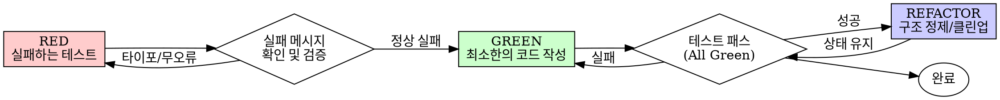

# zb-TDD

이 스킬은 **실패하는 테스트 작성(RED) ➡️ 최소한의 코드 구현(GREEN) ➡️ 코드 리팩토링(REFACTOR)**으로 이어지는 TDD의 핵심 주기를 강제하고, 모킹 남용과 안티패턴을 방지하여 테스트 신뢰도를 보장하는 워크플로우를 정의합니다.

## 🚨 TDD의 철칙 (The Iron Law)

```text
실패하는 테스트 코드가 먼저 작성되지 않은 프로덕션 코드는 절대 허용하지 않습니다.
```

*   **코드 작성 후 테스트 추가 금지**: 실수나 편의로 인해 코드를 먼저 작성했다면, **즉시 해당 코드를 모두 삭제**하고 테스트부터 다시 작성하십시오 (Sunk Cost Fallacy 극복).
    - 코드 보관용 임시 백업이나 "참조용"으로 보존하는 꼼수도 전면 금지합니다. 삭제는 완전한 삭제를 의미합니다.

---

## 🔄 Red-Green-Refactor 주기 (TDD Cycle)



1.  **RED (실패하는 최소 테스트 작성)**:
    - 하나의 세부 요구사항만 검증하는 가장 간단한 단위 테스트를 작성합니다.
    - 테스트 실행 후 **의도한 실패 메시지(기능 미구현으로 인한 실패)**가 콘솔에 뜨는지 눈으로 직접 확인합니다. (바로 성공하거나 무관한 컴파일 에러 발생 시 테스트를 즉시 수정하십시오.)
    - **[예외 및 에러 디버깅]**: 테스트 작성 혹은 초기 실행 시 예기치 못한 비즈니스 로직 에러나 런타임 오류가 발생하면, 즉시 **REQUIRED SUB-SKILL: [zb-debugging](../zb-debugging/SKILL.md)**을 사용하여 원인을 분석한 후 수정하십시오.
2.  **GREEN (통과를 위한 최소 코드 구현)**:
    - 테스트를 가까스로 통과할 수 있는 **가장 간단하고 직관적인 형태의 코드**만 구현합니다 (오버엔지니어링 금지).
3.  **REFACTOR (중복 제거 및 이름 정리)**:
    - 테스트가 초록불(Pass)인 상태를 온전히 유지하면서, 중복 코드를 제거하고, 변수/함수명을 다듬으며 설계를 정비합니다.

---

## 🚫 모킹 안티패턴 방지 (Mocking Standards)

[docs/QUALITY_SCORE.md](file:///docs/QUALITY_SCORE.md) 규칙에 따라 모킹은 다음 세 가지 철칙을 따릅니다:

1.  **모크 동작 자체를 검증하지 말 것**:
    - `toHaveBeenCalled()` 등 모크가 호출되었는지만 체크하는 테스트는 무효합니다. 모크 호출의 결과로 발생한 실제 상태 변화나 반환값 등 **진짜 부수 효과(Side-Effects)**를 검증하십시오.
2.  **프로덕션 코드에 테스트용 코드 추가 금지**:
    - 테스트 정리(Teardown)를 위해 프로덕션 클래스 내부에 `destroy()`나 `clearTest()` 같은 테스트 전용 메서드를 만드는 행위를 금지합니다. 리소스 정리는 테스트 유틸리티 모듈로 이관하십시오.
3.  **모킹은 외부 시스템 경계로 제한할 것**:
    - 파일 I/O, 네트워크 HTTP 요청, 시스템 타이머 등 제어 불가능한 외부 바운더리만 모킹하십시오.
    - 내부 비즈니스 로직이나 모듈 간 호출은 실제 인스턴스를 사용하는 통합 테스트 작성을 최우선으로 합니다.
4.  **완전한 모크 데이터 구조화**:
    - 외부 응답 등을 모킹할 때 일부 필드만 채우는 부분 모크(Partial Mock)를 만들지 마십시오. 실 환경과 동일한 완전한 API 스키마 객체를 모킹하여 다운스트림 오류를 방지합니다.
