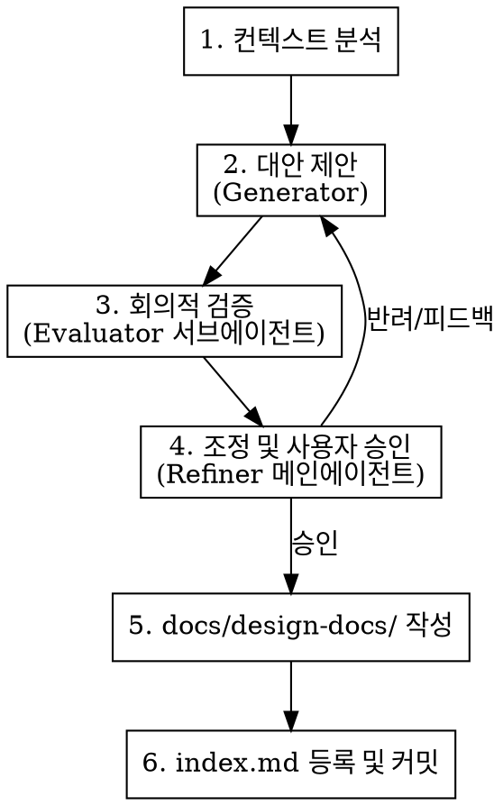

# zb-brainstorming

이 스킬은 **생성자(Generator) - 판별자(Evaluator) - 조정자(Refiner)**로 구성된 3-Agent 협업 흐름을 통해, 아이디어를 검증된 아키텍처 설계 문서(`docs/design-docs/[명칭]-design.md`)로 도출하는 워크플로우를 정의합니다.

## 🛠️ 핵심 체크리스트 (Checklist)

1. `[ ]` **프로젝트 컨텍스트 탐색**: 최신 파일 구조, 기존 설계 문서, 커밋 분석
2. `[ ]` **Generator (생성자 - 대안 제시)**: 2~3가지 설계 대안 및 장단점 분석 제시
3. `[ ]` **Evaluator (판별자 - 회의적 검증)**: 별도 서브에이전트를 소환해 설계안의 취약점/예외 상황/YAGNI 위반사항만 무자비하게 색출 (좋은 점 기술 금지)
4. `[ ]` **Refiner (조정자 - 설계 정제)**: 판별자 피드백을 반영해 설계를 수정하고 사용자 승인 획득
5. `[ ]` **설계 문서 작성**: `docs/design-docs/[주제]-design.md` 생성 및 [index.md](docs/design-docs/index.md) 목록에 링크 추가

*시각적인 UI 설계나 레이아웃 검토가 동반되는 경우, [visual-companion.md](visual-companion.md) 가이드에 따라 `.claude/skills/zb-brainstorming/scripts/start-server.sh` 서버를 실행하여 브라우저에서 디자인 시안을 검증하십시오.*

---

## 🔄 프로세스 흐름 (Process Flow)



---

## 📝 설계 문서 템플릿 (Design Doc Template)

`docs/design-docs/[주제]-design.md` 형식으로 작성하며 다음 양식을 따릅니다:

```markdown
# [설계 주제] Design Document

## 1. 목적 & 요구사항 (Goal & Requirements)
- 해결하려는 문제와 주요 요구사항

## 2. 3-Agent 검증 결과 (GAN Evaluation)
- **판별자(Evaluator)가 제기한 이슈**: 
- **조정(Refining) 대책**: 

## 3. 상세 설계 (Detailed Design)
- 아키텍처, 컴포넌트 구조 및 데이터 흐름

## 4. 예외 및 실패 대응 (Edge Cases & Fault Tolerance)
- 잠재적 실패 시나리오 및 예외 처리 정책
```

---

## ⚠️ 흔한 실수 (Common Mistakes)

- **코드 작성 먼저 수행**: 설계 및 사용자 승인 전에 실제 구현(Implementation)에 돌입하는 행위
- **자기 방어적 검증**: Generator 역할을 하는 메인 에이전트 스스로 설계를 평가하여 검증이 느슨해지는 현상 (반드시 회의적 시각의 독립 서브에이전트 활용 필수)
