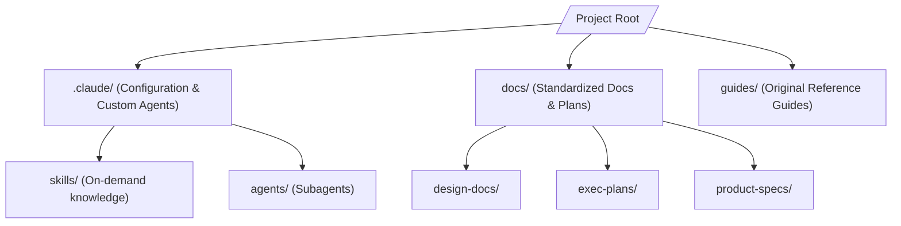

# Architecture Map (Fervent)

This document provides a high-level package and domain mapping of the repository to orient agents and human developers.

## 📂 Core Component Map

* **`/.claude/`**: Specific developer harness configurations.
  * **`skills/`**: Domain specific instructions loaded on-demand.
  * **`agents/`**: Task-specific subagents for security, refactoring, and linting.
* **`/docs/`**: Primary documentation hub.
  * **`design-docs/`**: High-level designs and core decisions.
  * **`exec-plans/`**: Active and completed execution plans, and the technical debt tracker.
* **`/guides/`**: System guidelines and references.
